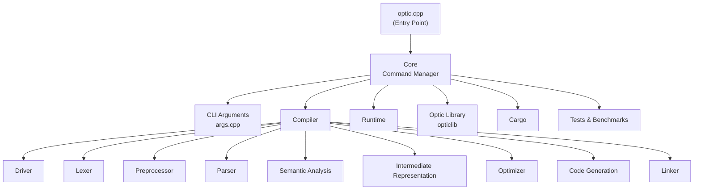

# The Optic Programming Language

> An experimental systems programming language focused on simplicity, performance, and accessibility.

Optic is an open-source programming language currently in early development.

The project began as an exploration of language design, compiler construction, and systems programming, with the long-term goal of creating a language that combines the readability of high-level languages with the control traditionally associated with low-level development.

At its current stage, Optic is primarily a learning and research project, and many aspects of the language are still evolving.

---

## Design Goals

Optic is being designed around a few core principles:

- **Readable syntax** inspired by modern high-level languages.
- **Performance-oriented architecture** suitable for systems-level development.
- **Direct interoperability with C and C++ libraries.**
- **Explicit control over program behavior and resources.**
- **A development experience that remains approachable without sacrificing power.**

These goals represent the direction of the project rather than fully implemented features.

---

## Example

### Hello World:

```c++
function main() {
    print("Hello World")
}
```

### Fibonacci:

```c++
function fibonacci(n: int) -> int {
    if n <= 1:
        return n;

    return fibonacci(n - 1) + fibonacci(n - 2)
}
```

### Binary Search:

```c++
function binary_search(&arr: array[int], x: int) -> int {
    int low = 0
    int high = arr.size() - 1

    while (low <= high) {
        int mid = low + (high - low) / 2

        if arr[mid] == x:
            return mid

        if arr[mid] < x {
            low = mid + 1
        } else {
            high = mid - 1
        }
    }

    return -1
}
```

---

## Current Status

Optic is currently in the **pre-alpha** stage.

### Implemented

- Lexer
- Driver
- Initial preprocessor

### In Progress

- Parser
- Semantic analysis
- Intermediate representation (IR)

### Planned

- Runtime system
- Virtual machine
- Standard library
- Native code generation
- C/C++ interoperability layer
- Integration with Cargo

---

## Repository Structure



---

## Roadmap

The long-term roadmap currently includes:

- Static type system
- Optional runtime features for increased flexibility
- Virtual machine execution
- JIT compilation research
- Native binary generation
- Memory management strategies
- Hardware abstraction layers
- Standard library ecosystem

The roadmap is exploratory and may change significantly as the project evolves.

---

## Philosophy

Optic is not intended to compete with mature languages today.

Instead, it serves as a platform for exploring:

- Programming language design
- Compiler implementation
- Runtime systems
- Systems programming concepts
- Software architecture

Building the project in public allows ideas, mistakes, and improvements to be documented throughout the process.

---

## Contributing

Feedback, discussion, and constructive criticism are always welcome.

Areas of particular interest include:

- Parsing techniques
- Semantic analysis
- Compiler architecture
- Runtime design
- Language semantics
- Optimization strategies
